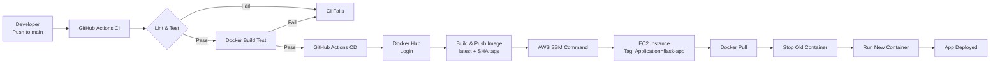

# Project 2: Dockerized Application + CI/CD Pipeline

A containerized Flask web application with automated CI/CD deployment to AWS EC2.

## Features Implemented
- Flask application
- Dockerfile (multi-stage build)
- Docker Compose
- CI/CD pipeline
- AWS deployment

## CI/CD Pipeline



### Pipeline Flow

1. **CI Workflow** (runs on push/PR):
   - Code linting with flake8
   - Test execution (optional)
   - Dockerfile linting with hadolint
   - Docker build validation

2. **CD Workflow** (runs on push to main):
   - Authenticate with Docker Hub
   - Build and push image with `latest` and `${{ github.sha }}` tags
   - Authenticate with AWS
   - Send SSM command to EC2 instance(s) tagged `Application=flask-app`
   - Instance pulls new image, stops old container, runs new container

## Local Development

### Prerequisites
- Docker and Docker Compose
- (Optional) Python 3.11+ for local development without Docker

### Running with Docker Compose
```bash
# Create .env file (optional - defaults to PORT=5000)
echo "PORT=5000" > .env
echo "ENVIRONMENT=development" >> .env
echo "APP_VERSION=1.0.0" >> .env

# Build and run
docker-compose up --build
```

Visit `http://localhost:5000` (or the port specified in `.env`)

### Running Locally (without Docker)
```bash
cd app
pip install -r requirements.txt
python main.py
```

Visit `http://localhost:5000`

## Endpoints
- `/` - Homepage
- `/health` - Health check endpoint
- `/api/info` - System information API

## Tech Stack
- Python 3.11
- Flask 3.0
- Gunicorn (production server)
- Docker (multi-stage builds)
- Docker Compose

## Building the Docker Image
```bash
docker build -t flask-app:local .
docker run -p 5000:5000 flask-app:local
```